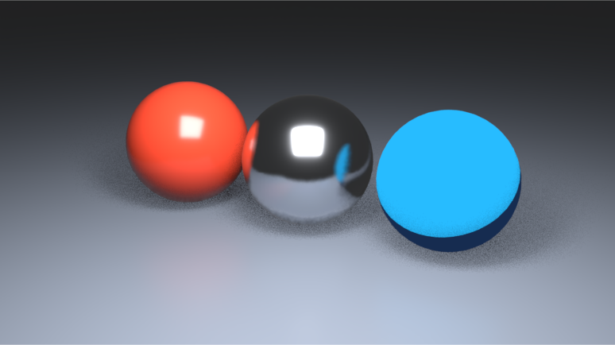

# EEVEE Bridge for Houdini

**Blender's EEVEE renderer, live in Houdini's Solaris viewport.**

EEVEE Bridge is a Hydra render delegate for Houdini 22 that renders your Solaris stage with Blender 5.2's EEVEE. It does not imitate EEVEE with custom shaders: a persistent, headless Blender process renders the scene with EEVEE itself, and the image appears in Houdini's viewport like any other Hydra renderer. Houdini stays the source of truth for geometry, lights, cameras, materials and render settings. You never open Blender or enable an add-on.

<p align="center">
  <br>
  <sub>The bundled demo scene in Houdini's Solaris viewport. The blue sphere uses an EEVEE-only <i>Shader to RGB</i> toon material.</sub>
</p>

- **Live and responsive.** EEVEE renders on a background thread, so Houdini's interface never waits for Blender. While you tumble the camera or edit the scene, EEVEE draws quick reduced-resolution frames, then refines to full quality when you stop.
- **Works with your Solaris scene as it is.** It handles meshes, subdivision surfaces, instancing, curves and volumes, plus USD Preview Surface, MaterialX and Karma materials. Dome lights with HDRIs light the scene, and cameras render with depth of field.
- **A real viewport renderer.** Click-picking and selection highlighting work, and real depth keeps Houdini's handles and grid in place. You can run several EEVEE viewports at once. Render stats and status messages appear in Houdini.
- **Final frames too.** The *EEVEE Render Settings* LOP exposes EEVEE's settings. It renders stills, sequences, render passes and Cryptomatte through Houdini's USD Render ROP and husk, and can render to MPlay.

> **Status:** Tested on Linux x86-64 with Houdini 22.0.368, Blender 5.2.0 LTS and NVIDIA GPUs under Vulkan. Windows support is implemented but has not been built or tested yet. See [Limitations](#limitations).

## Contents

- [How it works](#how-it-works)
- [Requirements](#requirements)
- [Quick start](#quick-start)
- [Using it](#using-it)
- [Performance](#performance)
- [Features](#features)
- [Limitations](#limitations)
- [Development](#development)
- [License](#license)

The full install manual is in **[INSTALL.md](INSTALL.md)**. It covers Windows, installer options, updates and rollback, render farms and troubleshooting. Release notes are in [CHANGELOG.md](CHANGELOG.md).

## How it works

```text
 Houdini                                                 Blender 5.2
 ┌───────────────┐   ┌───────────────────┐  scene edits  ┌───────────────┐
 │ Solaris stage │──>│ EEVEE Bridge      │──────────────>│ EEVEE worker  │
 └───────────────┘   │ Hydra delegate    │     binary    │ one scene per │
                     │ render thread     │<──────────────│ viewport      │
                     └─────────┬─────────┘     pixels    └───────────────┘
                               v           shared memory
                    Solaris viewport or husk
```

- **Only changes travel.** The C++ delegate turns Hydra prims into compact edits and sends only what changed, over an authenticated loopback connection. Arrays go as raw binary, and unchanged arrays are not sent again. Pixels come back through shared memory.
- **One worker, many viewports.** A single Blender worker serves every viewport in a Houdini session. Each viewport gets its own Blender scene, and compiled shaders, textures and identical materials are shared between them.
- **Disk renders are isolated.** Each disk render or husk job starts its own worker, and the worker exits when the job ends or is cancelled.

## Requirements

| | |
| --- | --- |
| **Houdini** | 22.0 (tested: 22.0.368). The plugin binary must match your exact Houdini build. The installer can rebuild it with the HDK that ships with Houdini. |
| **Blender** | 5.2 LTS. The installer checks for EEVEE and OpenVDB support, and adds NumPy and OpenEXR privately if Blender lacks them. |
| **GPU** | A Vulkan-capable GPU and driver (tested on NVIDIA). OpenGL is available as a fallback. |
| **OS** | Linux x86-64 (tested) or Windows x86-64 (implemented, untested). |
| **Build tools** | Only when building from source: CMake 3.22 or later and the C++ compiler your Houdini HDK expects. |

## Quick start

**Linux, prebuilt for Houdini 22.0.368.** Download `houdini-eevee-0.6.1-linux-x86_64.zip` from [Releases](https://github.com/LilBadger/houdini-eevee-bridge/releases), then run:

```bash
unzip houdini-eevee-0.6.1-linux-x86_64.zip
cd houdini-eevee-0.6.1-linux-x86_64
bash install.sh
```

**Any other Houdini 22 build, or a clone of this repository.** Build the plugin against your Houdini:

```bash
git clone https://github.com/LilBadger/houdini-eevee-bridge.git
cd houdini-eevee-bridge
bash install.sh --build
```

If the installer cannot find Houdini or Blender, pass `--houdini /opt/hfs22.0.368 --blender /path/to/blender`.

The installer copies the bridge to `~/.local/share/houdini-eevee/<version>` and adds one package file to your Houdini `packages` folder. It then renders a small test image with EEVEE on your GPU. It needs no administrator rights and makes no changes to `houdini.env` or your Blender preferences.

Restart Houdini, open a Solaris network, and choose **EEVEE Bridge** from the viewport's renderer menu.

## Using it

1. In a Solaris viewport, pick **EEVEE Bridge** from the renderer menu. The first time, the Blender worker starts in the background. The status bar reports progress while shaders compile, and Houdini stays usable meanwhile.
2. Optionally, add an **EEVEE Render Settings** LOP at the end of your stage. It holds EEVEE's quality settings, the environment, render passes, color management and output. Use **Render to Disk**, **Render to Disk in Background** or **Render to MPlay** to render final frames.
3. Look through a stage camera to see its exact framing and depth of field.

### Viewport options

These appear with the renderer's settings in the viewport's display options:

| Option | Default | What it does |
| --- | --- | --- |
| EEVEE Samples | 16 | Viewport samples when the stage has no EEVEE Render Settings. If it has one, that node's *Viewport Samples* value is used. |
| EEVEE Ray Tracing | On | Viewport ray tracing when the stage has no EEVEE Render Settings. |
| Scene Up Axis | Y | The stage's up axis when there are no EEVEE Render Settings. EEVEE Render Settings reads it from the stage. |
| Navigation Resolution | Half | Resolution of the quick frames drawn while the camera or scene changes. *Full* turns reduced-resolution frames off. |
| Texture Size Limit | Full Resolution | Largest texture size uploaded to the GPU for the viewport. Lower it to save video memory. Disk renders always use full-resolution textures. |
| Subdivision Surfaces | Fast | *Fast* shows the subdivided cage, like Houdini's own viewport. *Exact* evaluates the true limit surface, as disk renders do, but takes much longer to build. |

### Depth of field

Depth of field comes from the USD camera. It turns on when the camera's **F-Stop** is above 0, and it uses the camera's focal length, focus distance and aperture aspect. It shows when you look through the camera and in disk renders. **Disable Camera Depth of Field** on EEVEE Render Settings turns it off.

## Performance

The benchmark is a production shot: 110 meshes (37 of them subdivided), 99 materials, 52 4K textures and 116,347 point instances. It renders at 1653×1078 with 64 viewport samples.

A headless Hydra harness (`probes/hydra_harness.cpp`) called the render pass the way Houdini's viewport does, 60 times a second, and timed how long each call blocked the calling thread. Houdini's viewport makes this call on its UI thread.

| | 0.5.1 | 0.6.1 |
| --- | --- | --- |
| Opening the shot | One 50.4 s call that freezes Houdini | The UI never blocks for more than 60 ms. First image after 2.7 s, all 64 samples after 8.3 s. |
| Uploading the scene | 16 s | 1.9 s |
| Orbiting the camera | Every frame blocks the UI (median 101 ms) | The UI stays at 60 Hz (longest call 0.3 ms), and new EEVEE frames arrive about 13 times per second. |
| Worker video memory | about 17 GB | about 7 GB, or 3.4 GB less with a 2048 texture limit |

All measurements were taken on an NVIDIA GeForce RTX 5090.

In this shot, EEVEE itself needs 60–70 ms to draw one reduced-resolution frame, mostly because Blender processes all 116k instances on every draw. That makes Blender, not the bridge, the limit on navigation speed here. On a lighter scene (`probes/bench_scene.py`), the harness receives about 38 new frames per second while orbiting.

`tools/gpu_benchmark.py` times each GPU in your machine and recommends one for the worker. The worker can run on a different GPU from Houdini's display at no extra transfer cost.

## Features

### Geometry
- **Meshes.** Supports authored normals, UVs, float and vector primvars, display color and opacity, left-handed orientation and degenerate faces.
- **Subdivision.** Supports Catmull-Clark and bilinear subdivision with creases, corners, and boundary and face-varying interpolation rules. EEVEE Render Settings sets separate viewport and render levels, plus a face budget per mesh.
- **Instancing.** Supports native USD instancing and point instancers. Large instancers use Geometry Nodes with full affine matrices, so shear and negative scale work.
- **Curves.** Linear basis curves become EEVEE hair curves with their widths.
- **Volumes.** OpenVDB and native Houdini volumes work, including live SOP volumes. The **EEVEE Volume Material** LOP controls density, color, absorption, anisotropy, emission, flame and temperature.

### Materials
- **Context priority.** Render contexts are used in this order: `eevee`, MaterialX (`mtlx`), Karma (`kma`), then USD Preview Surface.
- **USD Preview Surface.** Supports UV readers, 2D transforms, color, roughness and normal textures, and texture color spaces.
- **MaterialX Standard Surface.** Maps to Blender's Principled BSDF, including base color, metalness, roughness, IOR, specular, coat, sheen, transmission, subsurface, emission, opacity and normals.
- **MaterialX nodes.** Supports images and UDIMs, texture coordinates and placement, math, mix, clamp, remap, color correction, channel operations, normal maps and bump.
- **Procedural noise.** MaterialX noises (2D/3D Noise, Fractal, Cell, Worley, Unified) and Karma Voronoi noise stay procedural in EEVEE, with no texture baking.
- **Karma extras.** Karma ramps sample Houdini's own ramp evaluator. Karma hair renders as a transmissive fiber approximation.
- **EEVEE shader graphs.** Graphs authored on the stage enable EEVEE-only looks such as toon shading with *Shader to RGB*.

Standard Surface and Principled BSDF are different shading models, so materials look close to Karma but not identical. Unsupported shader nodes render magenta and are named in the worker log. VEX and compiled Karma shaders cannot run in EEVEE; use MaterialX equivalents or baked textures instead.

### Lights and environment
- **Lights.** Rect, disk, sphere, distant and cylinder lights, with intensity, exposure, color temperature, normalization and diffuse and specular multipliers.
- **World.** Dome lights drive EEVEE's world: lat-long HDRIs, rotation, tint and exposure. Multiple domes add together. EEVEE Render Settings can override the environment with an HDRI or a color, or turn it off.

### Cameras and motion
- **Cameras.** Perspective and orthographic cameras with lens shift, pixel aspect and clipping. Depth of field works in the viewport and in renders.
- **Motion blur.** Final renders blur camera, object, instance and deformation motion from USD time samples, or from point velocities and accelerations.

### Output
- **Final frames.** Stills and frame ranges render through Houdini's USD Render ROP, using a separate worker for each job. Output can be PNG, EXR or other formats Blender can write.
- **Render passes.** Depth, mist, normal, position, vector, diffuse and specular light and color, volume light, emission, environment, shadow, AO and transparency are available. Shader AOVs and Cryptomatte are written to a multilayer EXR or a `.passes.exr` file next to the image.
- **Viewport passes.** The viewport can display EEVEE's preview passes.
- **MPlay.** Renders beauty plus the standard passes to MPlay.

### Viewport
- **Background rendering.** Houdini's UI never waits for EEVEE. Navigation frames use reduced resolution, and refinement takes at most one intermediate step, because EEVEE restarts accumulation whenever the sample count changes.
- **Instant feedback.** A solid preview appears while a new session compiles its shaders. Progress and errors appear in the status bar and render stats.
- **Picking and depth.** A flat ID pass on settled frames supplies prim and instance IDs and window-space depth.
- **Viewport controls.** Multiple viewports, pause and resume, and automatic reconnection to a restarted worker.

## Limitations

- **Windows** support (build, installer and transport) is implemented but has not been built or tested yet.
- **Houdini version.** The plugin binary must match your exact Houdini build. Use `--build` for any build other than 22.0.368.
- **Material fidelity.** Karma and MaterialX materials are approximated with Blender's BSDFs. VEX shaders are not supported.
- **Picking.** Point instances drawn through Geometry Nodes pick as their prototype prim. Face and point picking is not provided.
- **Not translated yet.** Probe baking, arbitrary world shader graphs, cubic curves and per-face-subset materials.
- **Heavy instancing.** Very large instance counts limit EEVEE's own frame rate, because Blender processes every instance on each draw.

## Development

Build the plugin with CMake. The installer's `--build` option runs the same steps.

```bash
cmake -S . -B build -G Ninja -DCMAKE_BUILD_TYPE=Release -DHoudini_DIR=/opt/hfs22.0/toolkit/cmake
cmake --build build
```

| Path | Contents |
| --- | --- |
| `src/` | The Hydra delegate. `delegate.cpp` holds registration and the render pass, `renderer.cpp` the background renderer and `prims.cpp` the prims. The rest is scene state, the protocol and render buffers. |
| `worker/` | The Blender worker. `eevee_worker.py` is the server and `session.py` the per-viewport scene. Other modules handle meshes, materials, lights, volumes, passes and picking. |
| `houdini/` | Package contents: renderer registration, viewport options, HDAs and the startup hook. |
| `tools/` | Installer runtime, worker supervision, husk wrapper, diagnostics, GPU benchmark, packaging and a demo scene. |
| `probes/` | A headless Hydra harness and profiling tools. See [probes/README.md](probes/README.md). |

After a build, `python3 tools/launch_houdini.py --demo` starts Houdini with the bridge from this folder and creates the demo scene shown above. `python3 tools/package_release.py --native-root build` builds a release archive.

Bug reports are welcome. Please include your Houdini and Blender versions, your GPU, and the worker log from `~/.cache/houdini-eevee/logs/` (see [Troubleshooting](INSTALL.md#troubleshooting)).

## License

This project is released under the [MIT License](LICENSE). Bundled third-party files keep their own licenses:

- [nlohmann/json](https://github.com/nlohmann/json) ([MIT](third_party/nlohmann/LICENSE.MIT))
- MaterialX standard-library definitions in `worker/materialx_nodes.json` ([modified Apache 2.0](third_party/materialx/LICENSE.txt))

Blender and Houdini are not included and must be installed separately. Blender and EEVEE are trademarks of the Blender Foundation, and Houdini is a trademark of Side Effects Software. This project is not affiliated with or endorsed by either.
